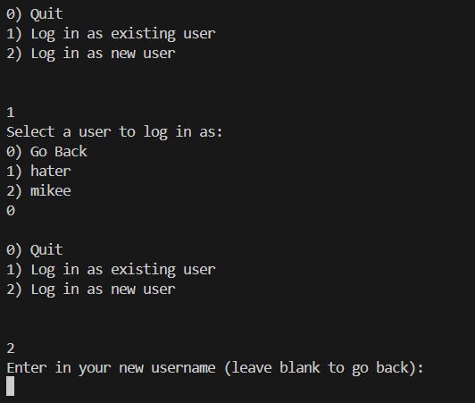
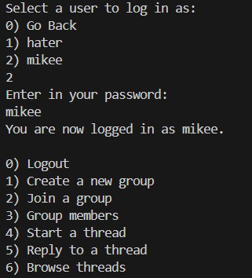
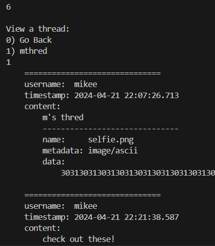
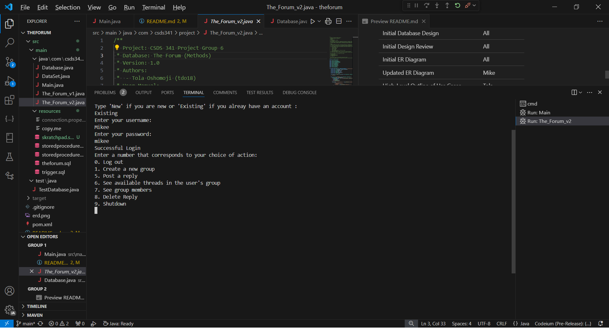

# Second Project Report

<!-- This is the 2nd Report for Team 6's project. It is written in markdown language and should be converted to PDF before submission. -->

## Table of Contents

1. [Team Members](#team-members)

2. [Database Name](#database-name)

3. [Problem Statement](#problem-statement)

4. [Updated ER-Diagram](#updated-er-diagram)

5. [Functional Dependencies and Normalization Issues](#functional-dependencies-and-normalization-issues)

6. [Physical Database Design](#physical-database-design)

    - [Tables](#tables)

    - [Indexes](#indexes)

    - [Triggers](#triggers)

7. [High-Level Outline of Use Cases](#high-level-outline-of-use-cases)

8. [Desired Applications for the Database](#desired-applications-for-the-database)

9. [Work Done and to be Done](#work-done-and-to-be-done)

10. [User Manual](#user-manual)

## Team Members

- Mikey Maldonado (mxm1667)
- Mike Zhang (zxz1233)
- Tola Oshomoji (tdo18)

## Database Name

The Forum

## Problem Statement

This database will keep track of group conversations in a forum. The original posters of each thread and all the replies to the thread. It will allow users to post topics to the public forum or to restrict access to a topic by group. Posts restricted to a group will only be viewable and repliable by members of the group.

## Updated ER-Diagram


<!-- Link to edit the ERD:
https://drive.google.com/file/d/1Mqd3s_5D0qhksFYDah-cYSEmzq6K9eE_/view?usp=sharing
-->

## Functional Dependencies and Normalization Issues

### Functional Dependencies

<!-- markdownlint-disable md033 -->
| | | |
|--|--|--|
| `ForumUser.username`      | → | `ForumUser` |
| ( `UserGroup.group_name`<br> `UserGroup.username` ) | → | `UserGroup` `ForumGroup` `ForumUser` |
| `UserGroup.group_name`    | → | `ForumGroup` `ForumUser` |
| `UserGroup.username`      | → | `ForumUser` |
| `ForumGroup.name`         | → | `ForumGroup` `ForumUser` |
| ( `ThreadGroup.thread_id` <br> `ThreadGroup.group_name` ) | → |`ThreadGroup` `Thread` `ForumGroup` `ForumUser` |
| `ThreadGroup.thread_id`   | → | `Thread` `ForumUser` |
| `ThreadGroup.group_name`  | → | `ForumGroup` `ForumUser` |
| `Thread.id`               | → | `Thread` `ForumUser` |
| `Reply.id`                | → | `Reply` `Thread` `ForumUser` |
| `Attachment.id`           | → | `Attachment` `Reply` `Thread` `ForumUser` |
<!-- markdownlint-enable md033 -->

### Normalization Issues

- `Thread` and `Reply` are similar in structure, but replies are generally child nodes of a thread. Normally, the starting of a thread begins with a post (with possibly its own attachments), but because `Reply` also has text content and attachments, we decided to have thread not have any content other than a title.
    <!-- More? -->

## Physical Database Design

### Tables

```sql
CREATE TABLE ForumUser (
    username VARCHAR(16) PRIMARY KEY,
    password VARCHAR(255) NOT NULL,
    date_created DATETIME NOT NULL,
    CONSTRAINT username_length_check CHECK (LEN(username) >= 3 AND LEN(username) <= 16)
);

CREATE TABLE Thread (
    id INT PRIMARY KEY IDENTITY,
    username VARCHAR(16) NOT NULL,
    title VARCHAR(50) NOT NULL,
    date_created DATETIME NOT NULL,
    FOREIGN KEY (username) REFERENCES ForumUser(username)
);

CREATE TABLE Reply (
    id INT PRIMARY KEY IDENTITY,
    thread_id INT NOT NULL,
    username VARCHAR(16) NOT NULL,
    content TEXT NOT NULL,
    date_created DATETIME NOT NULL,
    FOREIGN KEY (username) REFERENCES ForumUser(username),
    FOREIGN KEY (thread_id) REFERENCES Thread(id)
);

CREATE TABLE Attachment (
    id INT PRIMARY KEY IDENTITY,
    reply_id INT NOT NULL,
    name VARCHAR(255) NOT NULL,
    metadata VARCHAR(255) NOT NULL,
    data VARBINARY(MAX) NOT NULL,
    FOREIGN KEY (reply_id) REFERENCES Reply(id),
    CONSTRAINT attachmentname_length_check CHECK (LEN(name) >= 1),
    CONSTRAINT attachmentname_unique_check UNIQUE (reply_id, name)
);

CREATE TABLE ForumGroup (
    name VARCHAR(50) PRIMARY KEY,
    date_created DATETIME NOT NULL,
    owner_name VARCHAR(16) NOT NULL
    FOREIGN KEY (owner_name) REFERENCES ForumUser(username),
    CONSTRAINT groupname_length_check CHECK (LEN(name) >= 1)
);

CREATE TABLE UserGroup (
    username VARCHAR(16) NOT NULL,
    group_name VARCHAR(50) NOT NULL,
    date_joined DATETIME NOT NULL,
    PRIMARY KEY (user_id, group_name),
    FOREIGN KEY (username) REFERENCES ForumUser(username),
    FOREIGN KEY (group_name) REFERENCES ForumGroup(id)
);

CREATE TABLE ThreadGroup (
    thread_id INT NOT NULL,
    group_name VARCHAR(50) NOT NULL,
    PRIMARY KEY (thread_id, group_name),
    FOREIGN KEY (thread_id) REFERENCES Thread(id),
    FOREIGN KEY (group_name) REFERENCES ForumGroup(id)
);
```

### Indexes

```sql
CREATE INDEX idx_thread_username ON Thread(username);
CREATE INDEX idx_forumgroup_ownername ON ForumGroup(owner_name);
CREATE INDEX idx_attachment_replyid ON Attachment(reply_id);
CREATE INDEX idx_reply_username ON Reply(username);
CREATE INDEX idx_reply_threadid ON Reply(thread_id);
CREATE INDEX idx_thread_title ON Thread(title);
```

### Triggers

A trigger that adds a user into the UserGroup table whenever a new row is inserted into the ForumGroup table such that the user who is the owner of the group is also added to the UserGroup table as a member of the group.

```sql
CREATE TRIGGER insertintoUserGroup
ON ForumGroup
AFTER INSERT
AS
BEGIN
    DECLARE @GroupName VARCHAR(50);
    DECLARE @OwnerName VARCHAR(16);

    SELECT @GroupName = name, @OwnerName = owner_name
    FROM inserted;

    INSERT INTO UserGroup (username, group_name, date_joined)
    VALUES (@OwnerName, @GroupName, GETDATE());
END;
```

## High-Level Outline of Use Cases

```sql
-- A user can create a group
INSERT INTO ForumUser (username, password, date_created)
VALUES ('user1', 'password1',  GETDATE())
INSERT INTO ForumGroup (name, owner_name, date_created)
SELECT 'CSDS 314 Q/A', F.username, GETDATE()
FROM ForumUser F
WHERE F.username = 'user1'

-- A user can join an existing group 
INSERT INTO ForumUser (username, password, date_created)
VALUES ('user2', 'password2',  GETDATE())
INSERT INTO UserGroup (username, group_name, date_joined)
SELECT F.username, G.name, GETDATE()
FROM ForumUser F, ForumGroup G
WHERE F.username = 'user2' and G.name = 'CSDS 314 Q/A'

-- A user can view all the thread IDs related to their group 
SELECT thread_id
FROM ThreadGroup
WHERE group_name = 'group the user is in' 

-- A user can view all memeber of the group they are in 
SELECT username
FROM UserGroup 
WHERE group_name = 'group the user is in' 

-- A user can see all threads created by members of their group 
SELECT T.username 
FROM Thread T inner join ThreadGroup G
ON (T.ID = G.thread_id)
WHERE group_name = 'group the user is in'

-- A user wants to change the title of a thread they created
UPDATE Thread
SET title = 'new title'
WHERE username = 'user1' and title = 'old title'

-- A user wants to add an attachment to a reply they already posted
INSERT INTO Attachment (reply_id, name, metadata, data)
SELECT R.id, 'attachment name', 'metadata', 'data'
FROM Reply R
WHERE R.username = 'user1' and R.content = 'reply content'
```

## High-Level Outline of the forum

- A user can start zero or many threads.

- A user can have zero or many replies to a thread.

- A user can own zero or many groups.

- A user can be a member of zero or many groups.

- A user can edit or delete their own threads, replies, and groups.

- A thread can have one or many replies.

- A thread can be in zero or many groups. A thread is considered public if it is in zero groups.

- A reply can have zero or many attachments. Each attachment is associated with one reply.

## Work Done and to be Done

| Work Done | Team Member |
| --- | --- |
| Initial Database Design | All |
| Initial Design Review | All |
| Initial ER Diagram | All |
| Updated ER Diagram | Mike |
| High-Level Outline of Use Cases | Tola |
| Desired Applications for the Database | Tola |
| Initial Java Application | Mikey |
| Functional Dependencies | Mike |
| Physical Database Design | Mikey |
| Java Functions | Tola |
| UI / Menu System | Mikey |
| Triggers | Tola |
| Add User | Tola |
| Add Group | Tola |
| Post Thread | Mikey |
| Post Reply | Mikey |
| Update Reply | Mike |
| Delete Reply | Mike |

## User Manual

### User Manual (Main)

Start the application from `Main.java`

First prompts user to login or create a new user in the Login Menu:

```txt
0) Quit
1) Log in as existing user
2) Log in as new user
```

Select an option by entering the corresponding number.

- If user chooses to exit, the program will exit.

- If user chooses to log in as an existing user, the program will prompt the user to enter in their username and password.
  Three attempts will be allowed before the user is prompted to start over.

- If user chooses to log in as a new user, the program will prompt the user to create a username and password, and the program will start with the new user logged in.



After the user has logged in successfully, the program will display the Main Menu:



```txt
    0) Logout
    1) Create a new group
    2) Join a group
    3) Group members
    4) Start a new thread
    5) Reply to a thread
    6) Browse threads
```

Select an option by entering the corresponding number.

- If user chooses to logout, the program will log out and will display the Login Menu again.

- If user chooses to create a new group, the program will prompt the user to enter in the name of the group, and a trigger will automatically put the user in that group.

- If user chooses to join a group, the program will list all groups in the database and prompt the user to select the group they want to join.

- If user chooses to start a new thread, the program will prompt the user to enter in the title of the thread, will prompt the user to post the thread to any available groups, and then prompt the user to post the first reply to the thread. If any required step is corrupted during this process, the database will roll back the changes.

- If user chooses to reply to a thread, the program will list all threads available to the user and prompt the user to select the thread they want to reply to.  Then the program will prompt the user to enter in the title of the thread, will prompt the user to post the reply with any number of attachments.

- If user chooses to browse threads, the program will list all threads available to the user and display all the replies and attachments.



### User Manual (TheForum v2)

- Start the application from `The_Forum_v2.java`

- This software provides a command-line interface to interact with the Forum database.
- It allows users to perform various operations such as creating a new user, logging in, creating/joining groups, 
  creating threads, posting replies, and viewing available threads and group members.



- Usage:
  - When prompted, type 'New' if you are a new user or 'Existing' if you already have an account.
  - If you're a new user, you'll be prompted to create a username and password. Ensure your username is unique and your password is between 3 and 16 characters long.
  - If you're an existing user, enter your username and password to log in.
  - After logging in, you'll be presented with a menu of options to choose from:
    - Create a new group
    - Join a group
    - Create a thread
    - Post a thread
    - Post a reply
    - See available threads in the user's group
    - See group members
    - Delete a reply
  - Follow the on-screen prompts to perform your desired operation.
  - At any time, type the corresponding option number to select an action from the menu.
